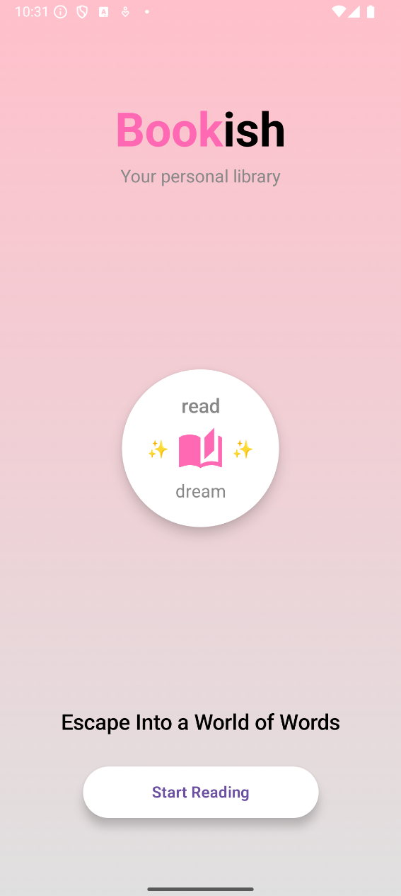
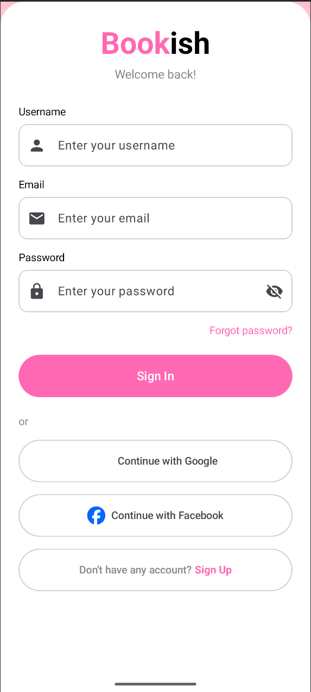
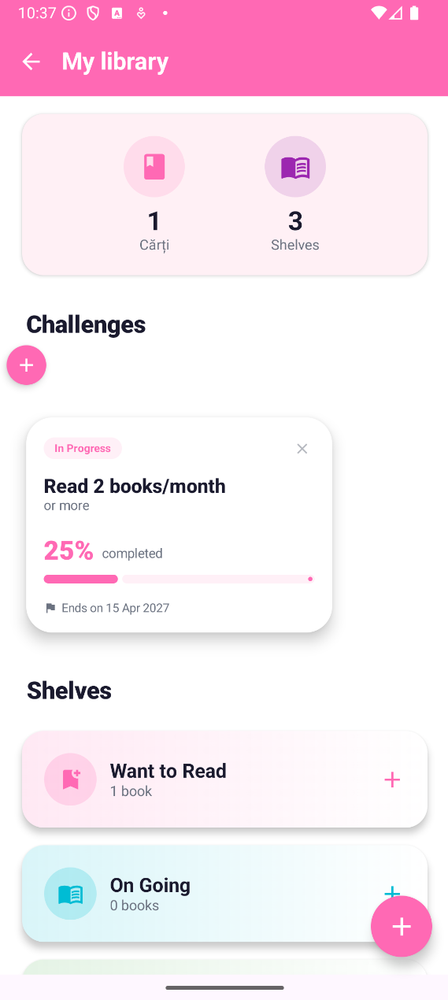
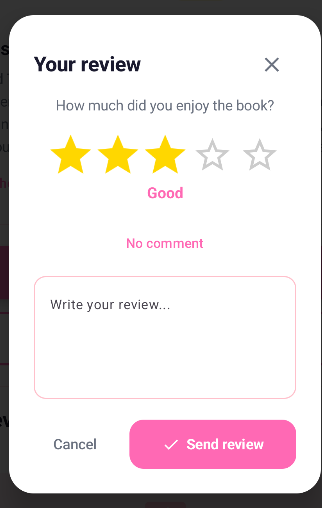

# Bookish -- Mobile Book Tracking App

A modern Android mobile application designed to help readers organize,
track, and improve their reading activity. **Bookish** combines personal
book tracking, reading challenges, reviews, social interaction, and
AI-assisted book discovery in a single application.

Developed as an **individual Bachelor's thesis project at Babeș-Bolyai
University**, the application explores modern Android development
practices together with Firebase cloud services and generative AI.

## About

Maintaining a consistent reading habit can be difficult because readers
may lose track of their progress, have difficulties organizing their
personal libraries, or lack motivation and interaction with other
readers.

Bookish was created to address these needs through a mobile-first
reading environment that allows users to:

-   organize books into personal shelves;
-   track their reading progress;
-   create and follow reading challenges;
-   rate and review books;
-   discover books through search and personalized recommendations;
-   communicate with other readers;
-   participate in book clubs;
-   use an AI-powered chatbot to identify books based on
    natural-language descriptions.

The application was inspired by existing book-tracking platforms,
particularly Goodreads, while introducing additional functionality such
as direct messaging and an AI-powered **Book Detective**.

## Main Objectives

The main objective of Bookish is to provide a modern and accessible
environment for managing reading activity while encouraging users to
maintain a consistent reading habit.

The project focused on:

-   designing a clear and user-friendly Android interface;
-   applying the **MVVM (Model--View--ViewModel)** architectural
    pattern;
-   integrating cloud-based authentication and data storage;
-   providing real-time synchronization of user data;
-   implementing social interaction between readers;
-   integrating generative AI into a mobile application;
-   evaluating usability through testing with real users.

## My Role

This was an **individual university project and Bachelor's thesis**, so
I was responsible for the complete development process:

-   analyzed existing book-tracking applications and their
    functionality;
-   designed the application structure and user flows;
-   designed the Firebase/Firestore data model;
-   implemented the Android application using Kotlin and Jetpack
    Compose;
-   implemented authentication and registration;
-   developed the personal library and reading-tracking functionality;
-   implemented reviews, ratings, challenges, profiles, and search;
-   implemented private messaging and book-club communication;
-   integrated Google Sign-In;
-   integrated Firebase services for cloud data and image storage;
-   integrated the Gemini LLM for the AI-powered Book Detective;
-   performed usability testing with real users;
-   analyzed user feedback and identified future improvements.

## Screenshots

### Welcome Screen



*The initial screen of the Bookish application, introducing the app's concept 
and encouraging users to start their reading journey.*

### Login Screen



*The authentication screen, allowing users to sign in using their username
or email and password, as well as Google authentication.*

### Personal Library



*The personal library where users can organize books into shelves, create reading challenges, and track their reading progress.*

### Search Screen


*The search functionality allows users to quickly find books based on 
their title, author, or genre.*

### Rating and Review System



*The rating and review system allows users to rate books from one to five stars 
and share their opinions through written reviews.*

### Friends and Book Clubs


*The social component of Bookish, supporting friendships, private messaging, 
book recommendations, and book club interactions.*

### Chatbot Detective


*The AI-powered Book Detective uses the Gemini LLM to identify books based on 
descriptions and clues provided by the user.*

## Features

### 🔐 Authentication

-   User registration and login
-   Username, email, and password authentication
-   Google Sign-In
-   Password recovery
-   Input validation and authentication feedback

### 📚 Personal Library

Users can organize their books using dedicated shelves:

-   **Want To Read**
-   **On Going**
-   **Completed**
-   Custom user-created shelves

Books can be moved between shelves as the user's reading progress
changes.

### 📈 Reading Progress

-   Track books currently being read
-   Mark books as completed
-   Monitor the number of completed books
-   Organize reading activity through personal shelves
-   Real-time updates of library information

### 🎯 Reading Challenges

Users can create their own reading challenges by specifying:

-   challenge title;
-   duration;
-   optional description;
-   progress.

Challenge progress can be updated directly through the application
interface.

### ⭐ Ratings and Reviews

Each book can contain:

-   a rating from 1 to 5 stars;
-   an optional written review;
-   the average rating calculated from user ratings;
-   reviews submitted by other readers.

Ratings also contribute to the recommendation and presentation logic
used by the application.

### 🔎 Book Search

Books can be searched using:

-   title;
-   author;
-   genre.

Search results are filtered dynamically to provide relevant books while
the user interacts with the search interface.

### 🏠 Personalized Home Screen

The Home screen provides several categories of books, including:

-   **Trending Now** -- books with high levels of interaction among
    users;
-   **Recommended For You** -- books selected using user information and
    reading preferences.
-   **Book Clubs** -- book clubs available, using user information and reading preferences

The recommendation logic considers information such as the user's bio
and highly rated reviews.

### 💬 Private Messaging

Users can communicate with their friends through private conversations.

The messaging system supports:

-   real-time text messages;
-   sharing books as recommendations;
-   searching for other users;
-   sending and accepting friend requests.

### 📖 Book Clubs

Bookish also provides group communication through book clubs.

Users can:

-   discover available book clubs;
-   join a club;
-   view their joined clubs;
-   communicate with other members through group messages.

### 🤖 AI Book Detective

One of the main original elements of Bookish is the AI-powered chatbot.

The chatbot uses **Gemini 2.5 Flash** and acts as a virtual **Book
Detective**. Instead of searching directly by title or author, users can
describe a book in natural language.

The chatbot:

1.  receives a description from the user;
2.  asks additional questions when necessary;
3.  analyzes the available Bookish catalog;
4.  identifies a matching book;
5.  provides the corresponding book to the user;
6.  allows the user to open its details and add it to their library.

The model is constrained to the application's available book catalog,
helping maintain consistency between AI responses and the actual
database.

## Application Architecture

Bookish follows the **MVVM (Model--View--ViewModel)** architectural
pattern.

``` text
                    ┌──────────────────────┐
                    │     Jetpack Compose  │
                    │         View        │
                    └──────────┬───────────┘
                               │
                               ▼
                    ┌──────────────────────┐
                    │      ViewModel       │
                    │  UI state & business │
                    │       logic          │
                    └──────────┬───────────┘
                               │
                               ▼
                    ┌──────────────────────┐
                    │     Repositories     │
                    │ Data access & logic  │
                    └──────────┬───────────┘
                               │
              ┌────────────────┼────────────────┐
              ▼                ▼                ▼
       Firebase Auth      Firestore        Firebase Storage
       Authentication     Database         Profile images
                               │
                               ▼
                         Gemini 2.5 Flash
                           AI Chatbot
```

This separation allows the user interface, application logic, and data
management to remain organized and easier to maintain.

## Tech Stack

-   **Platform:** Android
-   **Language:** Kotlin
-   **UI:** Jetpack Compose
-   **Architecture:** MVVM
-   **Authentication:** Firebase Authentication
-   **Database:** Cloud Firestore
-   **Cloud Storage:** Firebase Storage
-   **AI:** Gemini 2.5 Flash
-   **AI Library:** Google Generative AI SDK
-   **Authentication provider:** Google Sign-In
-   **Build environment:** Android Studio
-   **Version control:** Git / GitHub


## Firebase Data

Cloud Firestore is used as the main NoSQL database and stores
information related to:

-   users;
-   books;
-   authors and genres;
-   shelves;
-   books assigned to shelves;
-   reviews;
-   friendships;
-   private messages;
-   book clubs;
-   book-club members;
-   group messages;
-   reading challenges.

Firebase Storage is used for user profile images.

## AI Integration

The AI component is integrated into the Android application through the
Gemini API.

The Book Detective receives a controlled catalog of books and a
conversation history. The conversation is managed locally in the
application, while the history sent to the model is limited to the most
recent messages to reduce unnecessary processing.

The application also uses the unique `book_id` returned by the AI
workflow to locate the corresponding book in Firestore and display it
using the application's own book details interface.

This approach connects the generative AI functionality with the
application's structured data rather than allowing the model to return
arbitrary books outside the available catalog.

## Usability Testing

Bookish was tested with **15 real users** who completed predefined usage
scenarios covering the main application functionality.

The testing scenarios included:

-   authentication;
-   adding books to shelves;
-   searching for books;
-   writing reviews;
-   completing books;
-   creating reading challenges;
-   interacting with the AI chatbot;
-   searching for friends;
-   sending friendship requests;
-   joining a book club;
-   editing the profile;
-   logging out.

The evaluation questionnaire was inspired by the **PSSUQ (Post-Study
System Usability Questionnaire)**.

The results indicated a high level of satisfaction regarding:

-   ease of use;
-   comfort while using the application;
-   ease of learning;
-   interface design;
-   navigation;
-   fulfillment of expected functionality.

The feedback also highlighted areas for future improvement,
particularly:

-   providing more detailed explanations for certain features;
-   improving error messages;
-   offering additional guidance in situations where users are unsure
    how to proceed.

These findings were useful for identifying practical improvements beyond
the purely functional requirements of the application.

## Project Structure

A simplified structure of the Android project is:

``` text
app/
└── src/
    └── main/
        ├── java/com/example/bookish/
        │   ├── models/
        │   ├── repositories/
        │   ├── ui/
        │   │   └── screens/
        │   ├── viewmodel/
        │   └── ...
        │
        ├── res/
        └── AndroidManifest.xml
```

The project separates models, repositories, screens, and ViewModels to
support the MVVM architecture.

## How to Run

### Prerequisites

-   Android Studio
-   JDK 17
-   Android SDK
-   A configured Firebase project
-   A Gemini API key
-   An Android emulator or physical Android device

### Firebase Configuration

Create a Firebase project and enable the required services:

-   Firebase Authentication
-   Google Sign-In
-   Cloud Firestore
-   Firebase Storage

Add the project's `google-services.json` file to the appropriate Android
application module.

### Gemini API Configuration

The Gemini API key should be stored locally and **must not be committed
to GitHub**.

For example, configure the key through the project's local
configuration:

``` properties
GEMINI_API_KEY=your_api_key_here
```

Use a restricted API key and keep credentials outside version control.

### Run the Application

1.  Clone the repository:

``` bash
git clone <YOUR_REPOSITORY_URL>
```

2.  Open the project in **Android Studio**.
3.  Configure the Firebase project and add `google-services.json`.
4.  Configure the Gemini API key locally.
5.  Synchronize the Gradle project.
6.  Select an Android emulator or connect an Android device.
7.  Run the application.

## Future Development

Potential future improvements include:

-   expanding AI-assisted personalized recommendations;
-   extending the Book Detective's capabilities;
-   introducing automatic organization of books based on reading
    activity;
-   automating challenge progress where appropriate;
-   adding notifications for messages and social interactions;
-   improving synchronization and performance under heavy usage;
-   expanding the social functionality of book clubs;
-   improving contextual help and error messages;
-   adding more advanced reading statistics and reports.

## Academic Context

**Bookish -- Mobile Book Tracking App** was developed as a Bachelor's
thesis project at **Babeș-Bolyai University**, Faculty of Mathematics
and Computer Science.

The project combines concepts from:

-   mobile application development;
-   software architecture;
-   cloud computing;
-   NoSQL databases;
-   user experience and usability;
-   social applications;
-   generative artificial intelligence.

The application was designed and implemented as a practical exploration
of how modern software technologies can be combined to support reading
management and reader interaction.

## Author

**Diana-Adelina Gliga**

Bachelor's Graduate --- Mathematics and Computer Science\
Babeș-Bolyai University

------------------------------------------------------------------------

> **Bookish --- Your personal library**\
> *Escape Into a World of Words*
